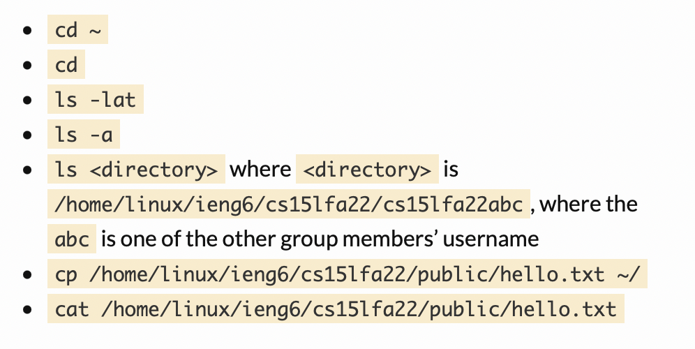

# CSE 15L Lab Report 1
## Remote access
---
This blog post is going to introduce how to log into a account on ieng6.

---

# Step 1: Visual Studio Code
[Visual Studio](https://code.visualstudio.com/) Here is the link for installing Visual Studio Code by clicking the **download** button. 

When you finish the install, here is what you will see.


# Step 2: Remotely Connecting
1. First at all, you need to [Install OpenSSH](https://learn.microsoft.com/en-us/windows-server/administration/openssh/openssh_install_firstuse?tabs=gui) if you are on Windowns.
2. Before everything, you need to reset your password on [this](https://sdacs.ucsd.edu/~icc/index.php) website only for course CSE15l and remember your account for this couse. Then, wait for 15 more minute. **If you are using macbook, the best way is using Google Chrome to reset the password.**

**After 15 min ! ! ! !**

3. In your Visual Studio Code, open your terminal
>  (Ctrl or Command + `, or use the Terminal → New Terminal menu option)

Write the below command on your Terminal.(Remember to replace **zz** by the letter in the last two letters from your accounts)
```
$ ssh cs15lfa22zz@ieng6.ucsd.edu
```
4. Enter the password

When you successfully login to the server, it would show like this:


# Step 3: Trying Some Commands
You can try some Commands below:


Here is the example with `ls` and `cp`.

`Ls` is to show what file we have. `Cp` is to copy the file to the home directory. `rm` is to remove the file from the home directory.

# Step 4: Moving Files over SSH with scp
Write `exit` in the terminal to log out the server.
1. First, Create a file on the computer called **WhereAmI.java** and add the below code into this file.
```
class WhereAmI {
  public static void main(String[] args) {
    System.out.println(System.getProperty("os.name"));
    System.out.println(System.getProperty("user.name"));
    System.out.println(System.getProperty("user.home"));
    System.out.println(System.getProperty("user.dir"));
  }
}
```
Then, in your terminal, compile and run the program.
```
javac WhereAmI.java
java WhereAmI
```
Then, RUN the below command with your user name.
```
scp WhereAmI.java cs15lfa22zz@ieng6.ucsd.edu:~/
```
Enter password to login ieng6 again. And then run the program in terminal
```
javac WhereAmI.java
java WhereAmI
```
one more time to see the difference. 
Here is what should be show when you done above steps.


# Step 5: Setting an SSH Key
When you doing step 4, you would figuer out that you need to enter password everytime. It would cost many time if you ruuning the file too many times.
Now, `ssh` keys is a great way to solve it. 
1. First called `ssh-keygen`, it would come up:

2. Enter below on your client
```
$ ssh cs15lfa22zz@ieng6.ucsd.edu
<Enter Password>
```
3. 
```
# now on server
$ mkdir .ssh
$ <logout> 
```
4. when you try one more time scp, it should not need to put the password again.
```
# back on client
$ scp /Users/joe/.ssh/id_rsa.pub cs15lfa22@ieng6.ucsd.edu:~/.ssh/authorized_keys
# You use your username and the path you saw in the command above
```

It would be came out something below


# Step 6: Optimizing Remote Running
Here is some hints that could make your life easier:
* write a command in quotes at the end of an ssh would run it code on remote server, then exit:
```
$ ssh cs15lfa22@ieng6.ucsd.edu "ls"
```
* you also can use semicolons to run multiple commands:
```
$ cp WhereAmI.java OtherMain.java; javac OtherMain.java; java WhereAmI
```

## That is all the step for login ieng6. 